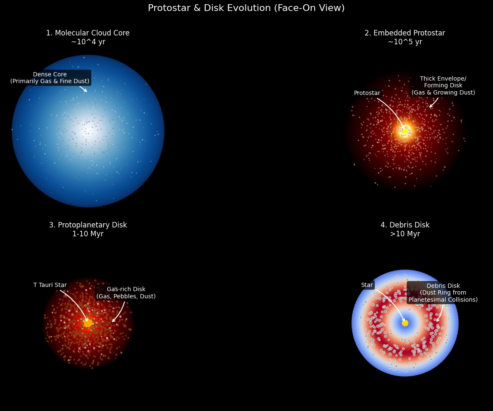
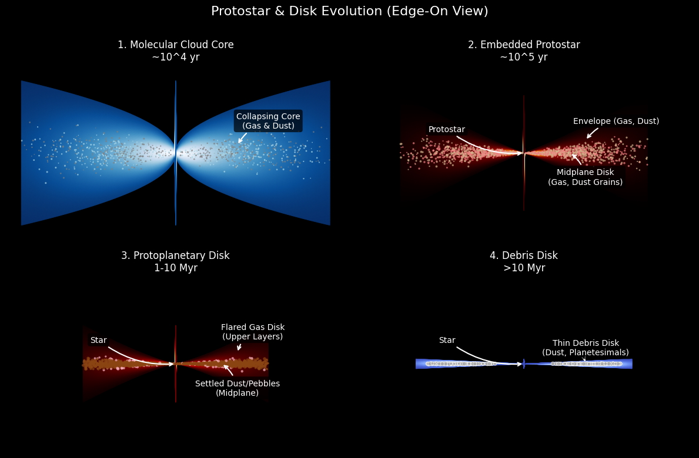

# Protostar and Disk Evolution Visualization

This Python script uses `numpy` and `matplotlib` to generate schematic visualizations of the key stages in the evolution of a protostar and its surrounding disk. It displays both face-on and edge-on perspectives for each stage.

## Stages Visualized

The script visualizes the following four distinct stages:

1.  **Molecular Cloud Core:** The initial dense, cold core collapsing under gravity. Primarily gas and fine dust. (~10^4 yr)
2.  **Embedded Protostar:** A young star forms at the center, still heavily obscured by a thick infalling envelope and a nascent disk. (~10^5 yr)
3.  **Protoplanetary Disk (T Tauri Stage):** The envelope has largely dissipated, revealing the central star surrounded by a flared, gas-rich disk where planets begin to form. Dust settles towards the midplane. (1-10 Myr)
4.  **Debris Disk:** Most gas has been cleared. The remaining disk is tenuous, composed mainly of dust generated by collisions between planetesimals (asteroids, comets). (>10 Myr)

## Features

*   Visualizes 4 key stages of star/disk evolution.
*   Provides both **face-on** and **edge-on** views in separate figures.
*   Uses `pcolormesh` to represent the general density/temperature structure (higher values are brighter/hotter based on the colormap).
*   Includes illustrative particles (`scatter`) representing gas, dust, pebbles, or debris, showing conceptual changes in composition and settling.
*   Models disk flaring (scale height increasing with radius) using a power law.
*   Includes annotations highlighting key features in each stage.
*   Configurable parameters for each stage (density/temperature profiles, particle counts, colors, scale height, flaring index, etc.) within the script.

## Sample Output

*(This script will generate two plot windows similar to the ones described below)*

**Face-On View:** A 2x2 grid showing the disk stages from above.


**Edge-On View:** A 2x2 grid showing the disk stages from the side, illustrating thickness and flaring.


## Requirements

*   Python 3.x
*   NumPy (`pip install numpy`)
*   Matplotlib (`pip install matplotlib`)

You can install the required libraries using the provided `requirements.txt` file.

## Installation

1.  **Clone the repository:**
    ```bash
    git clone <your-repository-url>
    cd <repository-directory>
    ```
2.  **(Recommended) Create a virtual environment:**
    ```bash
    python -m venv venv
    source venv/bin/activate  # On Windows use `venv\Scripts\activate`
    ```
3.  **Install dependencies:**
    ```bash
    pip install -r requirements.txt
    ```

## Usage

Simply run the Python script from your terminal:

```bash
python disk_evolution_viz.py
